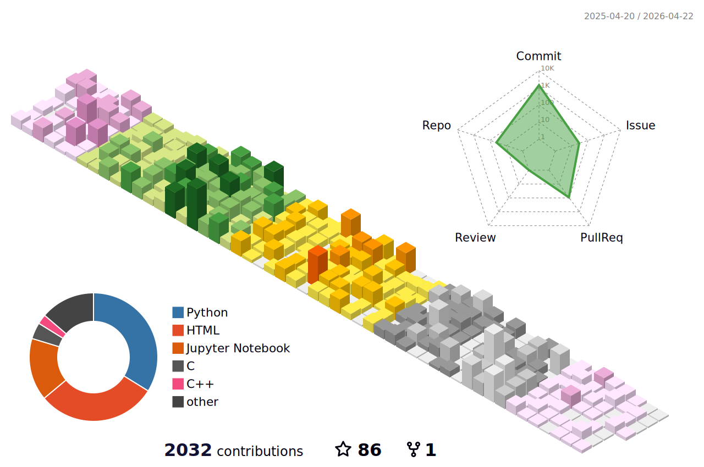

<header>
    <h1>Hello, I am Xiyuan Yang! 👋</h1>
</header>

Xiyuan Yang is now an undergraduate (sophomore) in School of Artificial Intelligence, Shanghai Jiao Tong University (SJTU-SAI)

  

### Open Source Projects

My research interests lie in **constructing general autonomous agents** and **multi-agent collaborations**. 

<table align="center" width="100%">

<!-- paper1: infomosaic-bench -->
<tr><td align="center" width="40%"></td> <td align="left" width="60%"> <b>[ICLR 2026]</b> InfoMosaic-Bench: Evaluating Multi-Source Information Seeking in Tool-Augmented Agents.</td> </tr> 

<!-- project1: intellisearch -->
<tr> <td align="center" width="40%">  </td> <td align="left" width="60%"> <b>IntelliSearch V3.1</b>: Unifying Search, Empowering Action for tool calling autonomous agents.</td> </tr> 

<!-- project2: sai community -->
<tr> <td align="center" width="40%">  </td> <td align="left" width="60%"> <b>SAI Community</b>: The first open-source SAIer's forum for courses, careers and future. </td> </tr> 

<!-- project3: my technical blog -->
<tr> <td align="center" width="40%">  </td> <td align="left" width="60%"> <b>Technical Blog</b>: My technical blogs! Computer science, artificial intelligence, and many more. </td> </tr> 

<!-- project4: science research codebase -->
<tr> <td align="center" width="40%">  </td> <td align="left" width="60%"> <b>Agent Codebase</b>: Generalized codebase of drawing, testing and pipelines for agentic scientific research.</td> </tr> 
</table>

### Course Labs

<table align="center" width="100%">
<!-- course-project1: E^3-ml-master -->
<tr> <td align="center" width="40%">  </td> <td align="left" width="60%"> <b>[Course-Project AI1811]</b> E³-ML-Master: Advanced Envisioning-Executing for Goal-Driven Self-Evolved ML-Master   </td> </tr>

<!-- course project2: LLM reasoning -->
<tr> <td align="center" width="40%">  </td> <td align="left" width="60%"> <b>[Course-Project AI1811]</b> LLM Reasoning: Enhancing Reasoning Abilities for LLMs using Reinforcement Learning </td> </tr> 

<!-- course project2: clustering -->
<tr> <td align="center" width="40%">  </td> <td align="left" width="60%"> <b>[Course-Project AI1811]</b> Clustering of High-Dimensional Data with Intrinsic Low Rank</td> </tr> 

<!-- course project3: image scaling -->
<tr> <td align="center" width="40%">  </td> <td align="left" width="60%"> <b>[Course-Project AI1807]</b> Two-Dimensional Image Scaling Methods Based on Classical Interpolation Algorithms and Their Extensions</td> </tr> 

</table>

### Languages & Tools

  
  
  
  
  
  
  
  
  
  
  
  
  
  
  

## 📊 GitHub Stats:

<footer>
    
© 2026 Xiyuan Yang. All rights reserved.

</footer>
