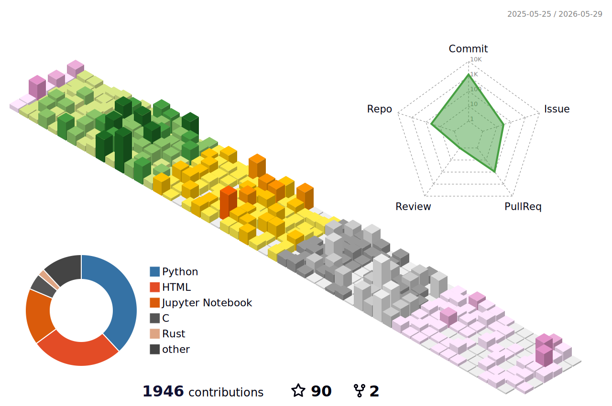

<header>
    <h1>Hello, I am Xiyuan Yang! 👋</h1>
</header>

Xiyuan Yang is now an undergraduate (sophomore) in School of Artificial Intelligence, Shanghai Jiao Tong University (SJTU-SAI)

  

### Publications

My research interests lie in exploring the **intelligence boundaries** of llm agents' capabilities:

- agent harness constructions
- agentic mid-training & post-training

<table align="center" width="100%">

<!-- paper1: infomosaic-bench -->
<tr><td align="center" width="40%"></td> <td align="left" width="60%"> <b>[ICLR 2026]</b> InfoMosaic-Bench: Evaluating Multi-Source Information Seeking in Tool-Augmented Agents.</td> </tr> 

<!-- paper2: mcp-persona -->
<tr><td align="center" width="40%"></td> <td align="left" width="60%"> <b>[ICML 2026]</b> MCP-Persona: Benchmarking LLM Agents on Real-World Personal Applications via Environment Simulation
</td> </tr> 

<!-- paper3: data-master -->
<tr><td align="center" width="40%"></td> <td align="left" width="60%"> DataMaster: Data-Centric Autonomous AI Research
</td> </tr> 

<!-- paper3: appcopilot -->
<tr><td align="center" width="40%"></td> <td align="left" width="60%"> AppCopilot: Toward General, Accurate, Long‑Horizon, and Efficient Mobile Agent
</td> </tr> 

</table>

### Open-Source Projects

<table align="center" width="100%">

<!-- project1: intellisearch -->
<tr> <td align="center" width="40%">  </td> <td align="left" width="60%"> <b>IntelliSearch V3.1</b>: Unifying Search, Empowering Action for tool calling autonomous agents.</td> </tr> 

<!-- project2: sai community -->
<tr> <td align="center" width="40%">  </td> <td align="left" width="60%"> <b>SAI Community</b>: The first open-source SAIer's forum for courses, careers and future. </td> </tr> 

<!-- project3: my technical blog -->
<tr> <td align="center" width="40%">  </td> <td align="left" width="60%"> <b>Technical Blog</b>: My technical blogs! Computer science, artificial intelligence, and many more. </td> </tr> 

<tr> <td align="center" width="40%">  </td> <td align="left" width="60%"> <b>LLM Infra Docs</b>: Core Source Code Analysis of Large-Scale Open-Source LLM Infra.</td> </tr> 

<!-- project4: science research codebase -->
<tr> <td align="center" width="40%">  </td> <td align="left" width="60%"> <b>Agent Codebase</b>: Generalized codebase of drawing, testing and pipelines for agentic scientific research.</td> </tr> 

<tr> <td align="center" width="40%">  </td> <td align="left" width="60%"> <b>PaperFlow</b>: Never use overleaf again!</td> </tr> 

<tr> <td align="center" width="40%">  </td> <td align="left" width="60%"> <b>SyncFlash</b>: Lightning-fast configuration of your server!</td> </tr> 

</table>

### Course Labs

<table align="center" width="100%">

<!-- AI1811(3): RL -->
<!-- course project2: LLM reasoning -->
<tr> <td align="center" width="40%">  </td> <td align="left" width="60%"> <b>[Course-Project AI1811]</b> LLM Reasoning: Enhancing Reasoning Abilities for LLMs using Reinforcement Learning </td> </tr> 

<!-- course project2: clustering -->
<tr> <td align="center" width="40%">  </td> <td align="left" width="60%"> <b>[Course-Project AI1811]</b> Clustering of High-Dimensional Data with Intrinsic Low Rank</td> </tr> 

<!-- course project3: image scaling -->
<tr> <td align="center" width="40%">  </td> <td align="left" width="60%"> <b>[Course-Project AI1807]</b> Two-Dimensional Image Scaling Methods Based on Classical Interpolation Algorithms and Their Extensions</td> </tr> 

<!-- course project4: kv press -->
<tr> <td align="center" width="40%">  </td> <td align="left" width="60%"> <b>[Course-Project AI2801]</b> CTR-Press: Compress-then-Refine for Training-Free KV Cache Compression</td> </tr> 

<tr> <td align="center" width="40%">  </td> <td align="left" width="60%"> <b>[Course-Project AI2802]</b> L-PHYM: Long-Horizon Language-Driven Physics-Based Motion Control</td> </tr> 

<tr> <td align="center" width="40%">  </td> <td align="left" width="60%"> <b>[Data Structure]</b> Data-Structure-Awesome: Course Notes and Source Code</td> </tr> 

<tr> <td align="center" width="40%">  </td> <td align="left" width="60%"> <b>[CMU 15213]</b> Computer Systems: A Programmer's Perspective (Labs and Learning Notes.)</td> </tr> 

<tr> <td align="center" width="40%">  </td> <td align="left" width="60%"> <b>[Standford CS336]</b> Language Models Learning Notes.</td> </tr> 

<!-- todo asr project to be added -->

</table>

### Languages & Tools

  
  
  
  <!--  -->
  <!--  -->
  
  
  
  
  
  
  
  
  
  

## 📊 GitHub Stats:

<footer>
    
© 2026 Xiyuan Yang. All rights reserved.

</footer>
